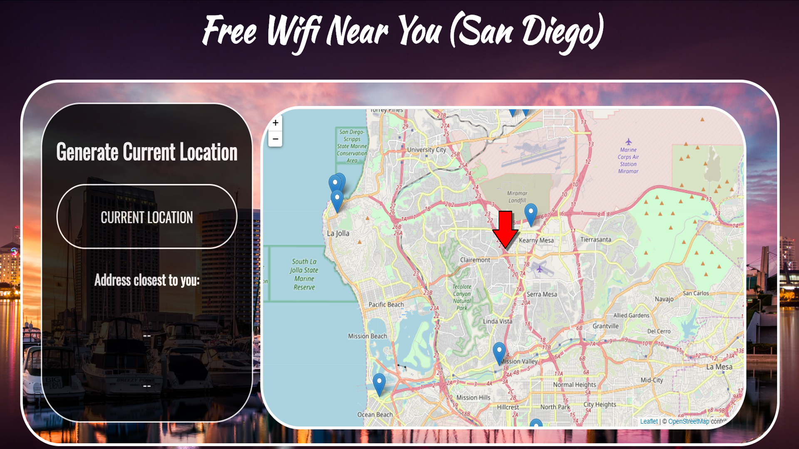

# FREE WIFI NEAR YOU 

### APP DESCRIPTION:

a web/mobile app that allows users to quickly find free wifi locations near them simply by clicking a couple of buttons

### TECHONOLIES USED IN THIS APP

#### Client-Side
- Jquery 
- Leaflet
- Leaflet Routing
- GoogleFonts

#### Server-Side
- Node
- Express

### GETTING STARTED

Once you have opened the app, click on the current location button to have your current location displayed.  From there, click on any of the markers closest to you to get address and routing location for the marker.  The markers are locations of areas with free wifi.  You can x out of the pop up page that displays once the marker is clicked to click on another marker and generate routing information for that address. And that's pretty much it.  Let me know if you have any questions or thoughts :) 

### PROJECT LINK 

https://free-wifi-near-you.herokuapp.com/

### STRETCH GOALS

- Need to improve the design of the app overall so that it is more mobile friendly.
- Need to apply additional styling to the map route inside of the map route modal.
- Need make it so that after a marker is clicked, the generated route to that marker from the users current location is not displayed until they click on the generate route button inside of the modal. 
- Need to add more central county markers 

#### Author: Brandon Harris